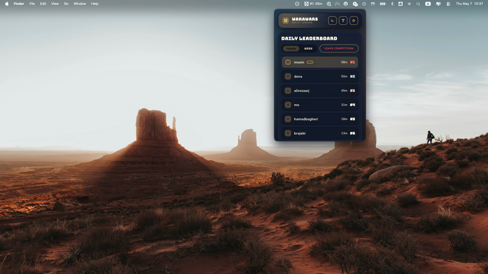

# WakaWars




WakaWars is a local-first coding leaderboard for friends, built as a macOS menu bar app with a shared backend.

## What It Does

- Tracks daily and weekly coding time using WakaTime.
- Ranks you against friends (and group members) with competitive leaderboard views.
- Supports private/friends/public visibility controls.
- Includes achievements, honor titles, coins, and a skin shop.
- Runs as a tray-first app on macOS with auto-update support.

## Monorepo Layout

```text
apps/
  server/         Elysia API + Prisma + PostgreSQL
  wakawars/       Electron menu bar shell (main/preload)
  wakawars-web/   React + Vite renderer UI
packages/
  shared/         Shared types + leaderboard helpers
```

## Stack

- Runtime/package manager: Bun workspaces
- API: Elysia (`/wakawars/v0`)
- DB: PostgreSQL + Prisma
- Desktop: Electron + `electron-builder` + `electron-updater`
- UI: React + Vite + Framer Motion

## Local Development

### 1) Install dependencies

```bash
bun install
```

### 2) Configure server env

```bash
cp apps/server/.env.example apps/server/.env
```

`apps/server/.env` needs a PostgreSQL `DATABASE_URL`.

### 3) Run migrations

```bash
bun run --filter @molty/server prisma:migrate
```

### 4) Seed shop skins (recommended)

```bash
bun run --filter @molty/server seed:skins
```

### 5) Start everything

```bash
bun run dev
```

This starts:

- API server at `http://localhost:3000`
- Renderer dev server at `http://localhost:5173`
- Electron menu bar app connected to those services

## Core API

Base path: `/wakawars/v0`

### Session and config

- `GET /session`
- `POST /session/login`
- `POST /session/logout`
- `POST /password`
- `POST /username`
- `GET /config`
- `POST /config`
- `POST /visibility`
- `POST /competition`

### Social and groups

- `POST /friends`
- `DELETE /friends/:username`
- `GET /users/search`
- `POST /groups`
- `DELETE /groups/:groupId`
- `POST /groups/:groupId/members`
- `DELETE /groups/:groupId/members/:username`

### Stats and achievements

- `GET /stats/today`
- `GET /stats/yesterday`
- `GET /stats/history`
- `POST /stats/refresh`
- `GET /stats/weekly`
- `GET /achievements`
- `GET /achievements/:username`

### Economy

- `GET /wallet`
- `GET /shop/skins`
- `POST /shop/skins/:skinId/purchase`
- `POST /shop/skins/:skinId/equip`

Session auth uses `x-wakawars-session`.

## WakaTime Integration

- Daily source: `GET https://wakatime.com/api/v1/users/current/status_bar/today`
- Weekly source: `GET https://wakatime.com/api/v1/users/current/stats/{range}`
- Auth: Basic auth with the WakaTime API key
- Server caches provider responses in memory to reduce request volume
- Background sync intervals:
  - Daily sync loop: every 2 minutes
  - Weekly cache loop: every 30 minutes
- Renderer auto-refresh: every 15 minutes

## Tests and Build

Run workspace tests:

```bash
bun run test
```

Run renderer tests:

```bash
bun run --filter @molty/wakawars-web test
```

Build all packages:

```bash
bun run build
```

## Desktop Packaging (macOS)

Local package:

```bash
bun run --filter @molty/wakawars pack
```

Publish build (DMG + ZIP + update metadata):

```bash
bun run --filter @molty/wakawars dist
```

- Auto-update feed: `https://core.molty.cool/updates`
- API base in packaged app: `https://core.molty.cool/wakawars/v0`
- Notarization hook: `apps/wakawars/build/notarize.cjs`

## Production URLs

- API: `https://core.molty.cool/wakawars/v0`
- Web renderer: `https://wakawars.molty.cool`
- Updates feed: `https://core.molty.cool/updates`
